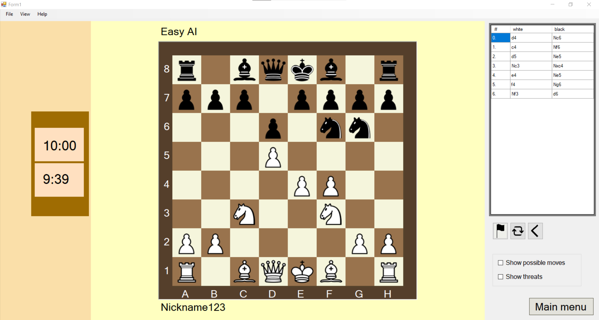
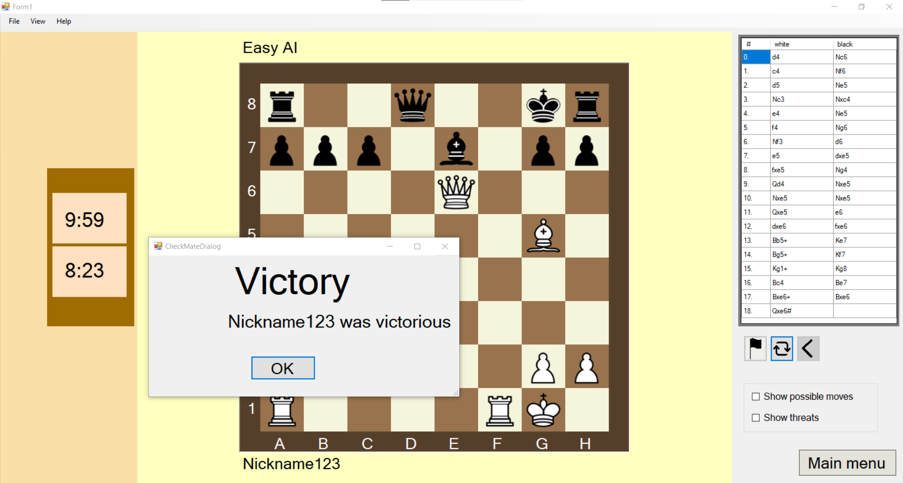
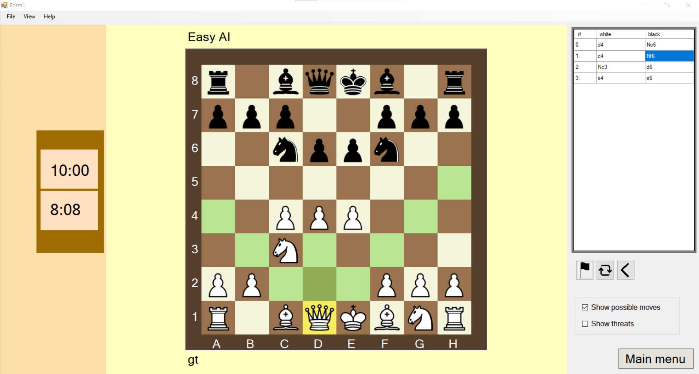
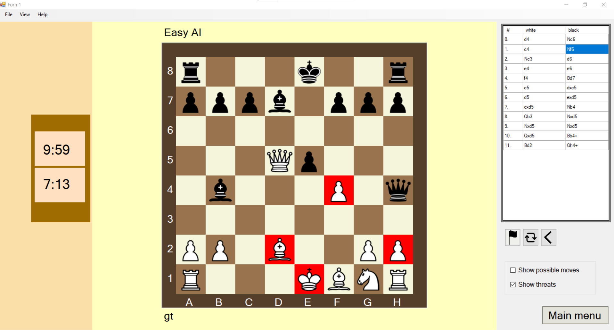

# ChessCsharp
This is a project I did as a homework for a course at my bachelor's degree in university. The AI is a minmax algorithm with varying depth according to the chosen difficulty. Made in 2021.

Properties:
 - you can choose color, difficulty and amount of time
 - you can save a game nand then load it
 - moves are recorded in the standard chess notation
 - you can undo moves
 - you can turn the board
 - you can be shown all the threats from the opponent

## Requirements
 - Visual Studio (or your own compiler)

## Credits
- [Tomáš Žilínek](https://www.linkedin.com/in/tomaszilinek)

